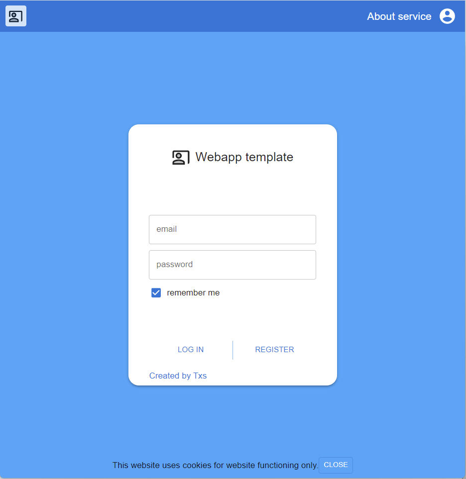

<h1>Webapp template with user authorization</h1>

The purpose of this repository is to have a tested MERN template with user authorization system implemented, which could be used as a starting code set for further app developments.

<h1></h1>

Functionally wise, app template includes the user registration form, login form, navigation bar, empty pages for app description, user profile, main app page, settings.

Registration form has the following features:

<ul>
<li>App checks that email, password, name are entered correctly and match standard patterns.</li>
<li>Email address is supposed to be unique, so app checks whether entered email is already registered</li>
<li>The information entered is sufficient for the registration process.</li>
</ul>

Login form functionality is pretty standard and allows user to login and to remember username so this not to be entered the next time visiting the app. Email input does the same email patterns check in order to prevent typos.

Navigation bar provides pretty standard functionality - before login it provides the possibility to navigate to the app description, register and login pages. After login, it has the following destinations: user profile, app settings, log out, app itself. Currently all the destinations except login and registration forms are simply empty pages.

The app is dockerized. Please pay attention to the related explanations regarding environmental variable in backend folder.

<h1></h1>

Technically wise, the app is based on the following technologies.

<h3>Backend</h3>
<ul>
<li>NodeJS</li>
<li>Express</li>
<li>JWT authorization strategy</li>
<li>Mongoose (for MongoDB connectivity)</li>
<li>Jest (for API tests)</li>
<li>Puppeteer (for e2e tests)</li>
</ul>
<h3>Frontend</h3>
<ul>
<li>React</li>
<li>Redux</li>
<li>MUI CSS styling</li>
<li>React testing libraries</li>
</ul>

More detailed description on both backend and frontend functionality is available in related folders. 

<h1></h1>

The following features are under development right now:

<ul>
    <li>Currently JWT tocken has a predefined lifetime and can be received / renewed only during login procedure. The intention is to update it automatically as long as browser window is opened. Another option is to renew it with any action user takes on a website. Necessary API is already implemented, frontend is yet to be updated.</li>
    <li>User profile component with the possibility to edit own data, delete own profile</li>
    <li>Admin panel admin to be able to see the list of al users, to delete users, to assign admin rights to other users.</li>
</ul>
<h1></h1>

Here are some screenshots of the app:

